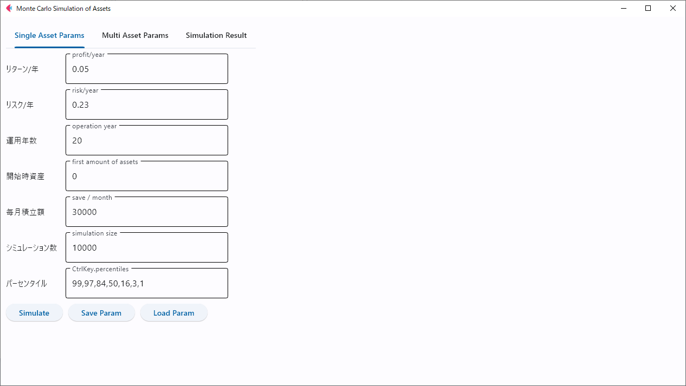
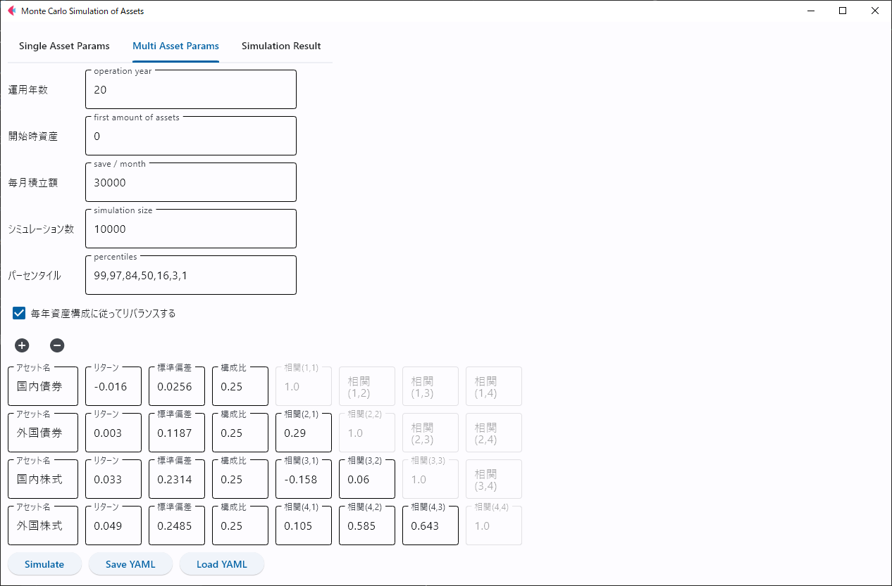
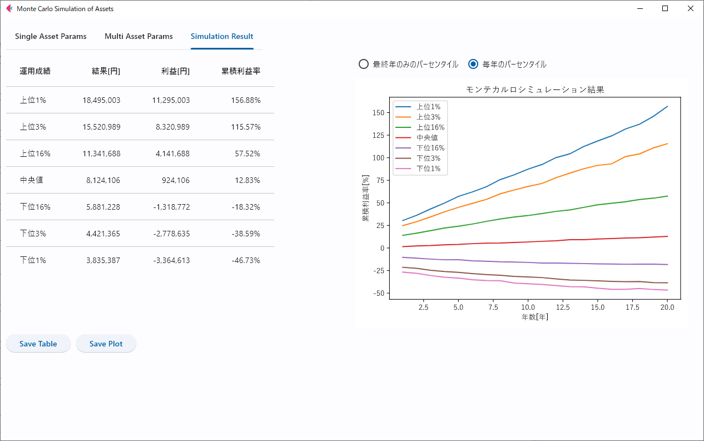

# 相関を持つ複数アセットでモンテカルロシミュレーションを行うGUIソフトウェア

## 概要
相関を持つアセット(資産)に対して、それぞれの平均リターンとリスク(標準偏差)、およびそれらの相関係数行列から、将来のリターンをモンテカルロシミュレーション(ランダムシミュレーション)により推定するGUIソフトウェア。

なお、注意点として以下の3つが存在するため、参考程度に利用すること。

- 資産は正規分布を仮定しており現実の分布とは異なる可能性が高い(ファットテール未考慮)
- ランダムシミュレーションなので理論的整合性はない
- 作成者は金融系の専門家ではない

## Run
### 実行ファイルの場合
Releaseより実行ファイルをDLして実行する

### Pythonスクリプトの場合
```bash
# install
poetry install

# run
poetry run python app.py

# build
poetry run flet pack app.py --name multi_assets_sim
```

## Usage
### 単一資産を用いる場合

アプリケーションを起動し、Single Asset Paramタブを選択する。



入力欄より以下を入力する。

- リターン: 年ごとのリターン
- リスク: 年ごとの標準偏差
- 運用年数: シミュレーションを行う年数
- 開始時資産: 開始時の運用資産の金額
- 毎月積立額: 運用資産に毎月追加される金額
- シミュレーション数: ランダムで試行を行う回数。大きすぎるとフリーズする恐れあり
- パーセンタイル: 表示したいパーセンタイルをカンマ(,)区切りで入力する

Save Paramで入力した値をYamlというファイル形式で保存できる。逆に保存した値はLoad Yamlから読み込める。

ここでSimulateボタンを押すとシミュレーションが実行され、Simulation Resultタブに移動する。


結果タブではシミュレーション結果が表とグラフで表示されている。設定したパーセンタイルに対して、それぞれ運用結果と元本との差分(利益)、累積利益率が示されている。

グラフでは毎年におけるパーセンタイルを表示するか、最終年のパーセンタイルの過去の騰落経過を選択して表示することができる。

Save Tableのボタンにて、csv形式でタブ左の表が保存できる。Save Plotでタブ右のグラフが画像形式で保存できる。(ファイル形式は保存時に拡張子で選択可能)


### 複数資産を用いる場合

アプリケーションを起動し、Multi Asset Paramタブを選択する。



入力欄より以下を入力する。

- 運用年数: シミュレーションを行う年数
- 開始時資産: 開始時の運用資産の金額
- 毎月積立額: 運用資産に毎月追加される金額
- シミュレーション数: ランダムで試行を行う回数。大きすぎるとフリーズする恐れあり
- パーセンタイル: 表示したいパーセンタイルをカンマ(,)区切りで入力する
- リバランス: 毎年目標構成比になるようにリバランスするかどうか(税金未考慮)

また、下部の表ではアセット名、リターン、標準偏差、目標構成比、相関係数行列を入力できる。
相関係数行列については対角成分は自己相関なので1で固定し、上三角要素は対称行列なので入力は不要となっている。

Save Paramで入力した値をYamlというファイル形式で保存できる。逆に保存した値はLoad Yamlから読み込める。

ここでSimulateボタンを押すとシミュレーションが実行され、Simulation Resultタブに移動する。




単一資産の際と結果タブは同じとなっている。

## パーセンタイルとは
統計において、全データの中央に位置するデータを中央値という。これを拡張した概念がパーセンタイルで、全データを1~100のパーセンタイルで表す。

中央値を50パーセンタイルとして、小さい値から5%の場所に位置するものを5パーセンタイル、逆に上位1%(小さい値から99%)に位置するなら99パーセンタイルという。

本ソフトウェアでは、全シミュレーションにおいて、中央値や上位・下位の結果がどの程度広がりを持っており、どういった結果になったかを示すのに利用している。


## 注意点
相関行列をセットする際、半正定値行列となるようにすることに注意。
計算にはnumpyの[multivariate_normal()](https://numpy.org/doc/stable/reference/random/generated/numpy.random.Generator.multivariate_normal.html)関数を利用しているが、対称行列かつ半正定値行列であることが前提。半正定値行列でなくても計算はできるが、正しさは保証されない。

半正定値行列: $n\times n$実対称行列$M$ に対して、任意の非ゼロベクトル$z$に対して、$z$と$Mz$の内積$(z,Mz)$が0以上、つまり$(z,Mz)\ge0$が成立する行列$M$のことをいう。この時$M$の任意の固有値$\lambda \ge 0$も成立する。

[wikipedia: 行列の定値性](https://ja.wikipedia.org/wiki/%E8%A1%8C%E5%88%97%E3%81%AE%E5%AE%9A%E5%80%A4%E6%80%A7)


## 参考データ

GPIFの2020年4月1日に適用した基本ポートフォリオでは相関係数行列は以下のように設定されているとのことで、本ソフトウェアの検証にはこのデータを用いている。([リンク](https://www.gpif.go.jp/gpif/portfolio.html))

| 相関係数 | 国内債券 | 外国債券 | 国内株式 | 外国株式 |
| -------- | -------- | -------- | -------- | -------- |
| 国内債券 | 1.00     |          |          |          |
| 外国債券 | 0.290    | 1.00     |          |          |
| 国内株式 | -0.158   | 0.060    | 1.00     |          |
| 外国株式 | 0.105    | 0.585    | 0.643    | 1.00     |

また、標準偏差と期待リターンは、以下のように設定されている。(名目賃金上昇率2.3%を減算した値)

|                       | 国内債券 | 外国債券 | 国内株式 | 外国株式 |
| --------------------- | -------- | -------- | -------- | -------- |
| 標準偏差[%]           | 2.56     | 11.87    | 23.14    | 24.85    |
| 期待リターン(名目)[%] | 0.7      | 2.6      | 5.6      | 7.2      |
| 期待リターン(実質)[%] | -1.6     | 0.3      | 3.3      | 4.9      |


## requirements.txt
Github Actionsに利用する。以下でエクスポートしたrequirements.txtを利用している。

```bash
poetry export --without-hashes --format requirements.txt --output requirements.txt
```


## Changelog

- 2023/11/11 ver 0.1.0
- 2023/11/11 ver 0.1.1: add dependency
- 2023/12/23 ver 0.1.2: add github actions
- 2023/12/23 ver 0.1.3: fix github actions
- 2023/12/23 ver 0.1.4: fix github actions